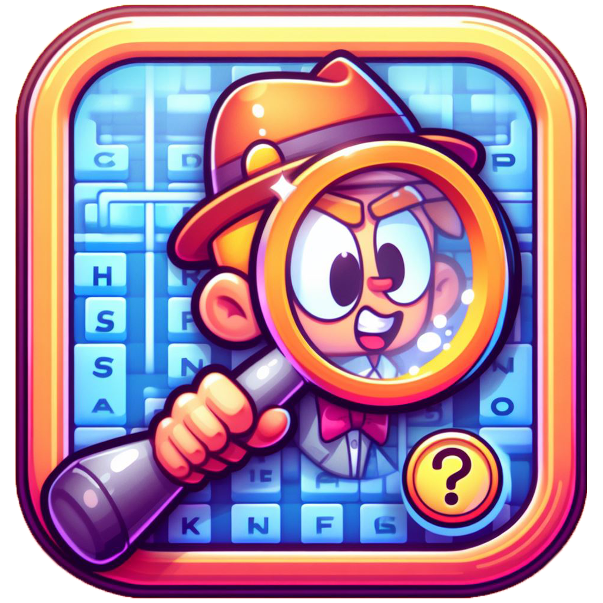
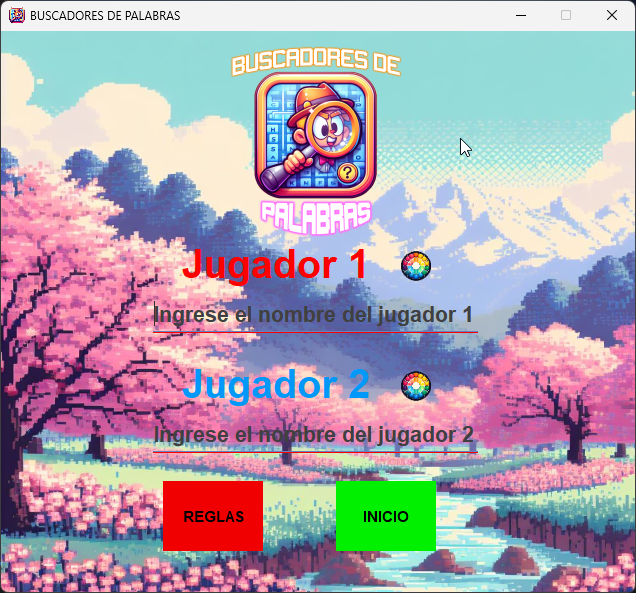
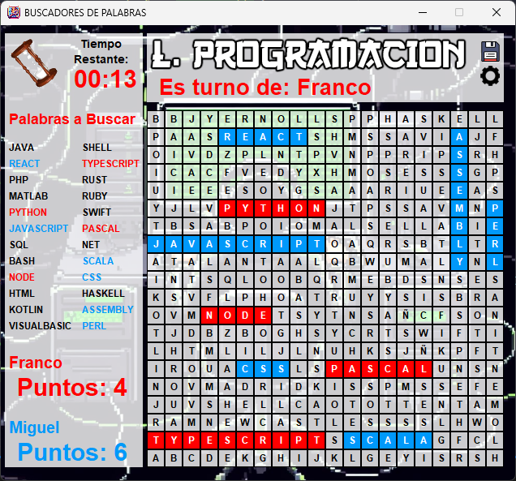
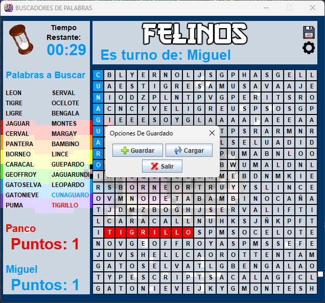

<h1 align="center" id="title">Buscadores de Palabras</h1>

<div align="center">
  

  
</div>

<p id="description" align="center">Buscadores de Palabras es un juego multijugador local que desafía a dos jugadores a encontrar la mayor cantidad de palabras en diferentes sopas de letras. ¿Serás capaz de ser el mejor buscador?</p>

<h2 align="center">Tabla de Contenidos</h2>

- [Vista Previa](#vista-previa)
- [Características](#características)
- [Cómo jugar](#cómo-jugar)
- [Instalación](#instalación)
- [Creado con](#creado-con)
- [Autores](#autores)

## Vista Previa

<div align="center">



</div>

## Características

- 🧑🤝🧑 **Define a los jugadores**: Ingresa nombres y elige un color único para cada uno.
- 🌍 **Temáticas variadas**: Desde sopas de letras de gatos hasta equipos de fútbol. ¡Elige tu favorita!
- ⏱️ **Temporizador por turnos**: 30 segundos para marcar palabras antes de pasar al rival.
- 🔍 **Modos de búsqueda**: Encuentra palabras en horizontal, vertical o diagonal.
- 💾 **Guardar y cargar partidas**: Continúa tu progreso luego. Si no seleccionas una ubicación al guardar, el juego te alertará.
- 🔊 **Configuración de sonido**: Activa o desactiva los efectos según tu preferencia.
- 🏆 **Competitividad**: Gana quien encuentre más palabras. En empate, decide la cantidad de letras.

## Cómo jugar

1. 🎮 **Selecciona un tema**: Posiciona el cursor sobre la opción deseada y haz clic.
2. ⏳ **Turnos cronometrados**: Cada jugador tiene 30 segundos para marcar palabras arrastrando el mouse en el tablero.
3. ✅ **Validación**: Si la palabra es correcta, se añade a tu lista.
4. 📂 **Guardar/Cargar**: Usa los botones en la esquina superior derecha para gestionar partidas.
5. ⚙️ **Configuración**: Ajusta el sonido durante el juego.

## Creado con

- ☕ **Java 20.0.2**  
- 🖥️ **NetBeans 18**

## Instalación

1. Clona el repositorio.
2. Abre el proyecto en NetBeans.
3. Ejecuta el proyecto: `Run Project`.
4. **Ejecutable JAR**: Si usas el archivo descargado, ejecuta en consola:

   ```bash
   java -jar "Buscadores_de_Palabras_-_Una_Aventura.jar"

## Autores

**Franco Rodriguez**  
👔 [LinkedIn](https://www.linkedin.com/in/jeannrodriguez)
<br>
**Yoserth Camacho**
